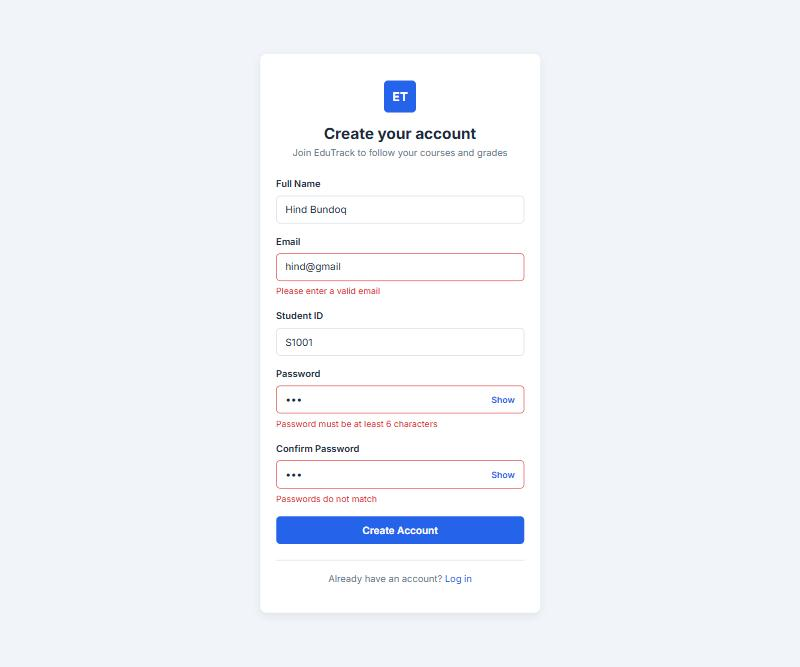
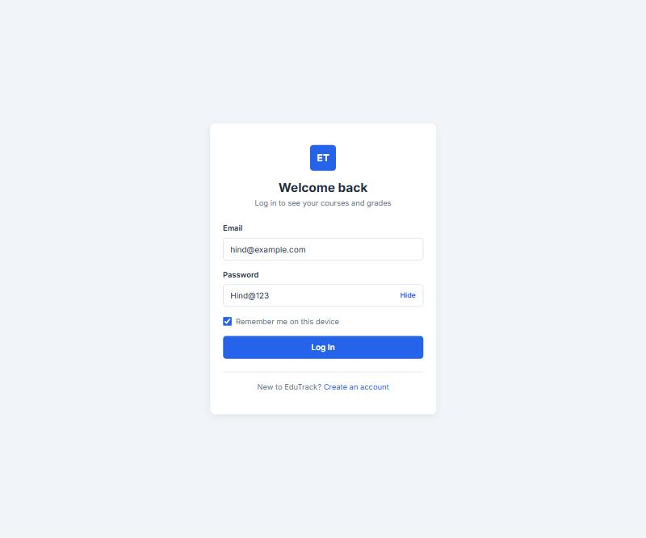
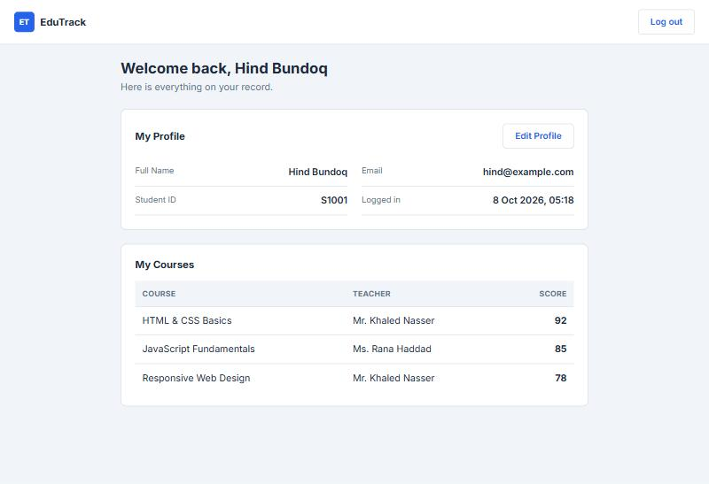
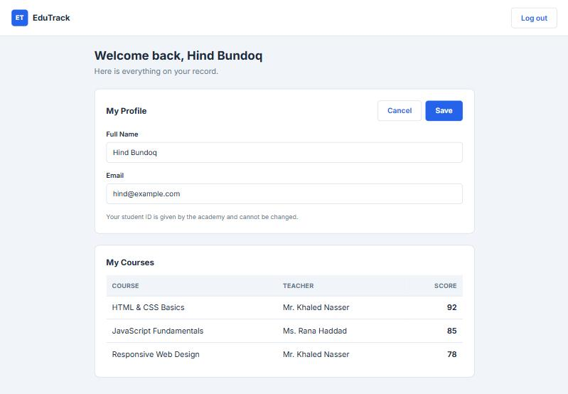
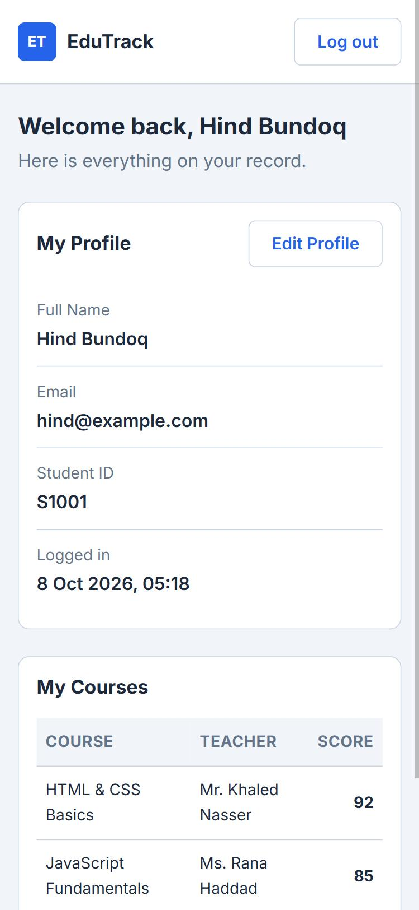

# EduTrack Student Portal

A responsive student portal where a student can create an account, log in,
and see their profile, courses, teachers and scores.

Built with **HTML, CSS and vanilla JavaScript (ES6 modules)**, with
[json-server](https://github.com/typicode/json-server) as a mock REST API
and Web Storage for the session. No frameworks and no build step.

---

## Screenshots

### Registration — with live validation


### Login — with "show password" and "remember me"


### Dashboard — profile, courses, teachers and scores


### Editing the profile


### On a phone


---

## Getting started

You need [Node.js](https://nodejs.org/) installed. Nothing else to install.

**1. Clone the project**

```bash
git clone https://github.com/HindBundoq/Edu-Track-Student-Portal.git
cd Edu-Track-Student-Portal
```

**2. Start the API**

```bash
npx json-server@0.17.4 db.json --port 3000
```

Leave this terminal open. You should see:

```
  \{^_^}/ hi!

  Resources
  http://localhost:3000/students
  http://localhost:3000/teachers
  http://localhost:3000/courses
  http://localhost:3000/enrollments
```

**3. Open the site**

Open `index.html` with the **Live Server** extension in VS Code.

**4. Log in with a demo account**

| Email | Password |
|---|---|
| `hind@example.com` | `Hind@123` |
| `omar@example.com` | `Omar@123` |

Or create a new account from the registration page.

---

## About json-server

`json-server` turns `db.json` into a real REST API without writing any
backend code. Every top level key in the file becomes an endpoint.

### Endpoints used by this project

| Method | Endpoint | Used for |
|---|---|---|
| `GET` | `/students?email=...` | Check an email is not already registered |
| `GET` | `/students?studentNumber=...` | Check a student ID is not already taken |
| `POST` | `/students` | Create a new account |
| `PATCH` | `/students/:id` | Save profile changes |
| `GET` | `/enrollments?studentNumber=...` | The courses one student is taking |
| `GET` | `/courses` | Course titles and their teacher |
| `GET` | `/teachers` | Teacher names |

All of these live in `js/modules/api.js`, so the server address is written
once and nowhere else.

### Two notes on running it

**Do not use `--watch`.** json-server writes to `db.json` itself on every
`POST` and `PATCH`. With `--watch` it also reloads the file when it changes,
so it can reload its own half written file and lose data. Without the flag
it is stable. If you edit `db.json` by hand, restart the server.

**The version is pinned to `0.17.4`** because json-server 1.x changed how
filtering and relations work.

---

## How the data is organised

```
students      id, fullName, email, studentNumber, password
teachers      id, name
courses       id, title, teacherId      -> teachers.id
enrollments   id, studentNumber, courseId, score
```

A student takes many courses and a course has many students, so
`enrollments` is the join table between them. The score lives there because
a score only means something as "this student, in this course".

The dashboard builds its table from three requests: the student's
enrollments, all courses, and all teachers. Each enrollment is matched to
its course, and each course to its teacher.

### Why `studentNumber` and not `studentId`

json-server treats any field ending in `Id` as a link to another table, and
deletes rows whose link points nowhere. A field called `studentId` inside
the `students` table was read as a link back to `students`, so every student
looked like an orphan and was wiped on the next delete. Renaming the field
to `studentNumber` fixed it. The form label still reads "Student ID".

---

## Features

### Registration
- Full name, email, student ID, password and confirm password
- Required fields, a valid email, a password of at least 6 characters,
  and both passwords matching
- Email and student ID are checked against the API so they stay unique
- Saves the student and sends them to the login page

### Login and session
- Credentials are checked against the API
- A wrong email and a wrong password give the **same** message, so the page
  never reveals which emails are registered
- The session holds the student's id, name, email, student number and login time
- **Remember me** decides where it is stored:
  - ticked — `localStorage`, so it survives closing the browser
  - not ticked — `sessionStorage`, so it disappears with the tab
- Signed out visitors cannot open the dashboard
- Signed in students are sent away from the login and register pages

### Dashboard and profile
- Welcome message with the student's name
- Profile card with name, email, student ID and login time
- Table of enrolled courses with the teacher and the score
- A clear message when the student has no courses yet
- **Edit profile** updates the name and email through `PATCH`, and updates
  the open session so the page refreshes without logging in again
- The student ID is read only — it is given by the academy, and changing it
  would break the link to the student's enrollments
- Logout clears the session and returns to the login page

### Bonus
- **Show / hide password** on both the login and registration pages

---

## Project structure

```
Edu-Track-Student-Portal/
├── index.html              Login page
├── register.html           Registration page
├── dashboard.html          Dashboard and profile
├── db.json                 The database json-server serves
├── css/
│   ├── main.css            Theme variables, reset, buttons, inputs, alerts
│   ├── auth.css            Layout of the login and register pages
│   └── dashboard.css       Layout of the dashboard
├── js/
│   ├── modules/
│   │   ├── api.js          Every call to the API
│   │   ├── validation.js   The validation rules
│   │   ├── session.js      Session storage and the page guards
│   │   └── passwordToggle.js
│   └── pages/
│       ├── loginPage.js
│       ├── registerPage.js
│       └── dashboardPage.js
└── screenshots/
```

The CSS is split by role rather than by page. `main.css` holds the theme as
CSS variables plus the parts every page shares, so changing a colour in
`:root` changes the whole site. The login and register pages share
`auth.css` because their layout is identical; the dashboard has its own file
because its layout is not.

---

## Tech

HTML5 · CSS3 · Vanilla JavaScript (ES6 modules, `fetch`, `async/await`) ·
json-server · localStorage and sessionStorage

---

## Author

**Hind Bundoq** — Orange Coding Academy
